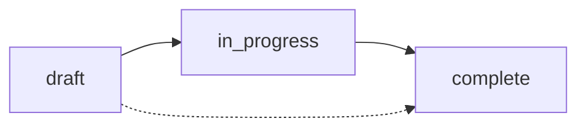

# Episode Management

Manage podcast episodes, transcripts, and generated content.

## List Episodes

Retrieve all episodes with metadata and guest information.

```bash
GET /api/sanity/episodes
```

<CodeGroup>
```bash cURL
curl https://production.youvebeenheard.com/api/sanity/episodes \
  -H "Cookie: auth_token=<token>"
```

```javascript JavaScript
const response = await fetch('https://production.youvebeenheard.com/api/sanity/episodes', {
  credentials: 'include'
})

const episodes = await response.json()
```
</CodeGroup>

### Response

```json
[
  {
    "_id": "episode_abc123",
    "_type": "episodeContent",
    "_rev": "v1",
    "transcript": "...",
    "prf": "...",
    "viralHooks": "...",
    "metadata": {
      "title": "Episode 385: Chris Pacifico on IT Leadership",
      "guestName": "Chris Pacifico",
      "guestLinkedinUrl": "https://www.linkedin.com/in/chris-pacifico/",
      "episodeNumber": 385,
      "topics": ["IT Leadership", "Vendor Management"],
      "summary": "Chris discusses modern IT leadership challenges"
    },
    "releaseDate": "2024-03-15",
    "socialPosts": {
      "linkedin": ["Post 1", "Post 2"],
      "instagram": [],
      "twitter": []
    },
    "generatedAssets": [],
    "assets": [],
    "videoAssets": [],
    "visualSuggestions": [],
    "scheduledPosts": [],
    "status": "complete",
    "isApproved": false,
    "prfApproved": true,
    "prfApprovedAt": "2024-03-10T10:30:00Z",
    "hooksApproved": true,
    "hooksApprovedAt": "2024-03-10T11:00:00Z",
    "linkedinApproved": false,
    "shareToken": "abc123xyz",
    "shareCreatedAt": "2024-03-10T09:00:00Z",
    "galleryUuid": "gallery_xyz",
    "createdAt": "2024-03-10T08:00:00Z",
    "updatedAt": "2024-03-15T14:30:00Z",
    "guestRef": {
      "_type": "reference",
      "_ref": "guest_123"
    },
    "guest": {
      "_id": "guest_123",
      "name": "Chris Pacifico",
      "linkedinUrl": "https://www.linkedin.com/in/chris-pacifico/",
      "position": "CIO",
      "company": "TechCorp"
    }
  }
]
```

<ResponseField name="episodes" type="array">
  Array of episode objects, ordered by `updatedAt` descending
</ResponseField>

## Get Episode

Retrieve a single episode by ID.

```bash
GET /api/sanity/episodes/:id
```

<ParamField path="id" type="string" required>
  Episode ID
</ParamField>

```bash
curl https://production.youvebeenheard.com/api/sanity/episodes/episode_abc123 \
  -H "Cookie: auth_token=<token>"
```

### Response

```json
{
  "_id": "episode_abc123",
  "transcript": "Full transcript text...",
  "prf": "PRF document...",
  "viralHooks": "<h2>Hook 1</h2>...",
  "metadata": {
    "title": "Episode 385",
    "guestName": "Chris Pacifico",
    "episodeNumber": 385
  },
  "guest": {
    "_id": "guest_123",
    "name": "Chris Pacifico"
  }
}
```

### Error Responses

| Status | Error | Description |
|--------|-------|-------------|
| `400` | Episode ID is required | Missing ID parameter |
| `404` | Episode not found | Episode does not exist |
| `401` | Unauthorized | Not authenticated |

## Create Episode

Create a new episode with optional transcript and guest reference.

```bash
POST /api/sanity/episodes
```

<CodeGroup>
```bash cURL
curl -X POST https://production.youvebeenheard.com/api/sanity/episodes \
  -H "Content-Type: application/json" \
  -H "Cookie: auth_token=<token>" \
  -d '{
    "transcript": "385-Chris Pacifico\nGuest: Chris Pacifico\n...",
    "guestId": "guest_123",
    "metadata": {
      "title": "Episode 385",
      "episodeNumber": 385
    }
  }'
```

```javascript JavaScript
const response = await fetch('https://production.youvebeenheard.com/api/sanity/episodes', {
  method: 'POST',
  headers: { 'Content-Type': 'application/json' },
  credentials: 'include',
  body: JSON.stringify({
    transcript: '385-Chris Pacifico\nGuest: Chris Pacifico\n...',
    guestId: 'guest_123'
  })
})

const episode = await response.json()
```
</CodeGroup>

### Request

<ParamField body="transcript" type="string">
  Episode transcript. If provided, metadata will be parsed from header.
</ParamField>

<ParamField body="guestId" type="string">
  Guest ID to link to episode. Guest data will pre-fill metadata.
</ParamField>

<ParamField body="metadata" type="object">
  Episode metadata (optional if guest provided)
  
  <Expandable title="metadata fields">
    <ParamField body="title" type="string">
      Episode title
    </ParamField>
    
    <ParamField body="guestName" type="string">
      Guest full name
    </ParamField>
    
    <ParamField body="guestLinkedinUrl" type="string">
      Guest LinkedIn profile URL
    </ParamField>
    
    <ParamField body="episodeNumber" type="number | string">
      Episode number (automatically coerced to integer)
    </ParamField>
    
    <ParamField body="topics" type="string[]">
      Episode topic tags
    </ParamField>
    
    <ParamField body="summary" type="string">
      Brief episode summary
    </ParamField>
  </Expandable>
</ParamField>

### Response

```json
{
  "_id": "episode_new123",
  "_type": "episodeContent",
  "transcript": "...",
  "metadata": {
    "title": "Episode 385",
    "guestName": "Chris Pacifico",
    "episodeNumber": 385,
    "topics": [],
    "summary": ""
  },
  "guestRef": {
    "_type": "reference",
    "_ref": "guest_123"
  },
  "status": "draft",
  "isApproved": false,
  "socialPosts": {
    "linkedin": [],
    "instagram": [],
    "twitter": []
  },
  "createdAt": "2024-03-15T10:00:00Z",
  "updatedAt": "2024-03-15T10:00:00Z"
}
```

<Note>
  **Transcript Parsing**: If a transcript is provided, the API automatically extracts metadata from the header (episode number, guest name, LinkedIn URL).
</Note>

### Error Responses

| Status | Error | Description |
|--------|-------|-------------|
| `400` | Invalid JSON | Request body is not valid JSON |
| `400` | Transcript too large | Transcript exceeds 5MB limit |
| `401` | Unauthorized | Not authenticated |
| `500` | Server configuration error | Missing SANITY_API_TOKEN |

## Update Episode

Update episode fields. Only provided fields are updated.

```bash
PATCH /api/sanity/episodes/:id
```

<ParamField path="id" type="string" required>
  Episode ID
</ParamField>

<CodeGroup>
```bash cURL
curl -X PATCH https://production.youvebeenheard.com/api/sanity/episodes/episode_abc123 \
  -H "Content-Type: application/json" \
  -H "Cookie: auth_token=<token>" \
  -d '{
    "prf": "Updated PRF content...",
    "prfApproved": true,
    "prfApprovedAt": "2024-03-15T10:30:00Z"
  }'
```

```javascript JavaScript
const response = await fetch(`/api/sanity/episodes/${episodeId}`, {
  method: 'PATCH',
  headers: { 'Content-Type': 'application/json' },
  credentials: 'include',
  body: JSON.stringify({
    prf: 'Updated PRF content...',
    prfApproved: true
  })
})

const updated = await response.json()
```
</CodeGroup>

### Request Fields

All fields are optional. Only include fields you want to update:

<ParamField body="transcript" type="string">
  Episode transcript
</ParamField>

<ParamField body="prf" type="string">
  PRF (Podcast Repurposing Framework) document
</ParamField>

<ParamField body="viralHooks" type="string">
  Viral hooks HTML content
</ParamField>

<ParamField body="releaseDate" type="string">
  Release date (YYYY-MM-DD format)
</ParamField>

<ParamField body="metadata" type="object">
  Episode metadata (see Create Episode for fields)
</ParamField>

<ParamField body="sanityPageMetadata" type="object">
  Metadata for Sanity podcast episode page
  
  <Expandable title="sanityPageMetadata fields">
    <ParamField body="title" type="string">
      Page title
    </ParamField>
    
    <ParamField body="shortDescription" type="string">
      Short description (1-2 sentences)
    </ParamField>
    
    <ParamField body="longDescription" type="string">
      Long description
    </ParamField>
    
    <ParamField body="keyTakeaways" type="string[]">
      Key takeaways (exactly 3)
    </ParamField>
    
    <ParamField body="showNotes" type="array">
      Timestamped show notes
    </ParamField>
  </Expandable>
</ParamField>

<ParamField body="socialPosts" type="object">
  Social media posts
  
  <Expandable title="socialPosts structure">
    <ParamField body="linkedin" type="string[]">
      LinkedIn posts
    </ParamField>
    
    <ParamField body="instagram" type="string[]">
      Instagram captions
    </ParamField>
    
    <ParamField body="twitter" type="string[]">
      Twitter/X posts
    </ParamField>
  </Expandable>
</ParamField>

<ParamField body="status" type="string">
  Episode status: `draft`, `in_progress`, or `complete`
</ParamField>

<ParamField body="prfApproved" type="boolean">
  PRF approval status
</ParamField>

<ParamField body="hooksApproved" type="boolean">
  Viral hooks approval status
</ParamField>

<ParamField body="linkedinApproved" type="boolean">
  LinkedIn posts approval status
</ParamField>

<ParamField body="assets" type="array">
  Generated image assets (unified asset storage)
</ParamField>

### Response

Returns the updated episode object (same structure as Get Episode).

## Delete Episode

Delete an episode and remove references from linked guests.

```bash
DELETE /api/sanity/episodes/:id
```

<ParamField path="id" type="string" required>
  Episode ID
</ParamField>

```bash
curl -X DELETE https://production.youvebeenheard.com/api/sanity/episodes/episode_abc123 \
  -H "Cookie: auth_token=<token>"
```

### Response

```json
{
  "success": true,
  "id": "episode_abc123",
  "removedFromGuests": 1
}
```

<ResponseField name="success" type="boolean">
  Deletion status
</ResponseField>

<ResponseField name="id" type="string">
  Deleted episode ID
</ResponseField>

<ResponseField name="removedFromGuests" type="number">
  Number of guest records updated to remove episode reference
</ResponseField>

<Warning>
  **Permanent Deletion**: This action cannot be undone. The episode and all associated data will be permanently removed.
</Warning>

## Episode Status Workflow

Episodes progress through these statuses:



| Status | Description |
|--------|-------------|
| `draft` | Episode created, no content generated |
| `in_progress` | PRF or hooks being generated |
| `complete` | All content generated and approved |

## Approval Flags

Each content type has independent approval:

- `prfApproved` / `prfApprovedAt` - PRF document
- `hooksApproved` / `hooksApprovedAt` - Viral hooks
- `linkedinApproved` / `linkedinApprovedAt` - LinkedIn posts
- `isApproved` - Overall episode approval

Approval timestamps are ISO 8601 strings:

```json
{
  "prfApproved": true,
  "prfApprovedAt": "2024-03-15T10:30:00Z"
}
```
