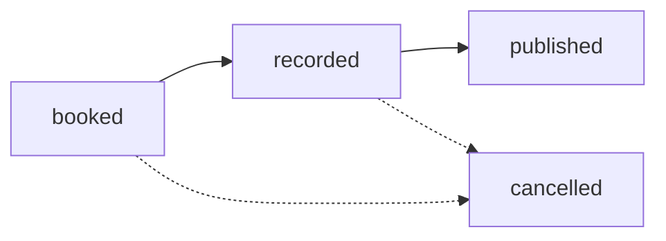

# Guest Management

Manage podcast guests, LinkedIn profile data, and episode associations.

## List Guests

Retrieve all guests with optional filtering, searching, and sorting.

```bash
GET /api/sanity/guests
```

<CodeGroup>
```bash cURL
curl "https://production.youvebeenheard.com/api/sanity/guests?status=recorded&limit=50" \
  -H "Cookie: auth_token=<token>"
```

```javascript JavaScript
const response = await fetch('/api/sanity/guests?status=recorded&sortField=name&sortDirection=asc', {
  credentials: 'include'
})

const data = await response.json()
console.log(`Found ${data.totalCount} guests`)
console.log('Guests:', data.guests)
```
</CodeGroup>

### Query Parameters

<ParamField query="status" type="string">
  Filter by guest status
  
  **Options**: `booked`, `recorded`, `published`, `cancelled`, `all`
</ParamField>

<ParamField query="inCircle" type="boolean">
  Filter by "In Circle" status
  
  **Options**: `true`, `false`
</ParamField>

<ParamField query="search" type="string">
  Search across name, position, company, and email
</ParamField>

<ParamField query="limit" type="number" default="100">
  Maximum results to return (max: 500)
</ParamField>

<ParamField query="offset" type="number" default="0">
  Number of results to skip for pagination
</ParamField>

<ParamField query="sortField" type="string" default="name">
  Field to sort by
  
  **Options**: `name`, `status`, `linkedinFollowers`, `inCircle`, `episodes`
</ParamField>

<ParamField query="sortDirection" type="string" default="asc">
  Sort direction
  
  **Options**: `asc`, `desc`
</ParamField>

### Response

```json
{
  "guests": [
    {
      "_id": "guest_123",
      "_type": "guest",
      "name": "Chris Pacifico",
      "position": "Chief Information Officer",
      "company": "TechCorp Inc.",
      "email": "chris@techcorp.com",
      "emailAlt": "chris.pacifico@gmail.com",
      "mobile": "+1-555-0123",
      "address": "San Francisco, CA",
      "linkedinUrl": "https://www.linkedin.com/in/chris-pacifico/",
      "linkedinFollowers": 12500,
      "inCircle": true,
      "status": "recorded",
      "isRepeatGuest": false,
      "episodeRefs": [
        {"_type": "reference", "_ref": "episode_abc123"}
      ],
      "shareLinks": [
        {
          "_key": "share_1",
          "shareToken": "xyz789",
          "episodeId": "episode_abc123",
          "createdAt": "2024-03-10T09:00:00Z"
        }
      ],
      "notes": "Interested in discussing AI in enterprise IT",
      "importedEpisodeNumber": 385,
      "transcript": "Full transcript if uploaded...",
      "_createdAt": "2024-01-15T10:00:00Z",
      "_updatedAt": "2024-03-10T14:30:00Z",
      "latestEpisode": {
        "_id": "episode_abc123",
        "releaseDate": "2024-03-15",
        "episodeNumber": 385
      }
    }
  ],
  "totalCount": 250,
  "limit": 50,
  "offset": 0
}
```

<ResponseField name="guests" type="array">
  Array of guest objects with episode references expanded
</ResponseField>

<ResponseField name="totalCount" type="number">
  Total number of guests matching the filter
</ResponseField>

<ResponseField name="limit" type="number">
  Limit applied to this request
</ResponseField>

<ResponseField name="offset" type="number">
  Offset applied to this request
</ResponseField>

## Get Guest

Retrieve a single guest by ID with expanded episode references.

```bash
GET /api/sanity/guests/:id
```

<ParamField path="id" type="string" required>
  Guest ID
</ParamField>

```bash
curl https://production.youvebeenheard.com/api/sanity/guests/guest_123 \
  -H "Cookie: auth_token=<token>"
```

### Response

```json
{
  "_id": "guest_123",
  "name": "Chris Pacifico",
  "position": "Chief Information Officer",
  "company": "TechCorp Inc.",
  "linkedinUrl": "https://www.linkedin.com/in/chris-pacifico/",
  "linkedinFollowers": 12500,
  "inCircle": true,
  "status": "recorded",
  "episodeRefs": [
    {
      "_id": "episode_abc123",
      "metadata": {
        "title": "Episode 385",
        "episodeNumber": 385
      },
      "status": "complete",
      "shareToken": "xyz789",
      "createdAt": "2024-03-10T08:00:00Z"
    }
  ],
  "shareLinks": [],
  "notes": "Great guest, interested in return appearance"
}
```

### Error Responses

| Status | Error | Description |
|--------|-------|-------------|
| `400` | Guest ID is required | Missing ID parameter |
| `404` | Guest not found | Guest does not exist |
| `401` | Unauthorized | Not authenticated |

## Create Guest

Create a new guest profile.

```bash
POST /api/sanity/guests
```

<CodeGroup>
```bash cURL
curl -X POST https://production.youvebeenheard.com/api/sanity/guests \
  -H "Content-Type: application/json" \
  -H "Cookie: auth_token=<token>" \
  -d '{
    "name": "Chris Pacifico",
    "position": "CIO",
    "company": "TechCorp",
    "email": "chris@techcorp.com",
    "linkedinUrl": "https://www.linkedin.com/in/chris-pacifico/",
    "linkedinFollowers": 12500,
    "status": "booked"
  }'
```

```javascript JavaScript
const response = await fetch('/api/sanity/guests', {
  method: 'POST',
  headers: { 'Content-Type': 'application/json' },
  credentials: 'include',
  body: JSON.stringify({
    name: 'Chris Pacifico',
    position: 'Chief Information Officer',
    company: 'TechCorp Inc.',
    email: 'chris@techcorp.com',
    linkedinUrl: 'https://www.linkedin.com/in/chris-pacifico/',
    linkedinFollowers: 12500,
    status: 'booked'
  })
})

const guest = await response.json()
```
</CodeGroup>

### Request

<ParamField body="name" type="string" required>
  Guest full name
</ParamField>

<ParamField body="position" type="string">
  Job title
</ParamField>

<ParamField body="company" type="string">
  Company name
</ParamField>

<ParamField body="email" type="string">
  Primary email address
</ParamField>

<ParamField body="emailAlt" type="string">
  Alternative email address
</ParamField>

<ParamField body="mobile" type="string">
  Mobile phone number
</ParamField>

<ParamField body="address" type="string">
  Mailing address or location
</ParamField>

<ParamField body="linkedinUrl" type="string">
  LinkedIn profile URL
</ParamField>

<ParamField body="linkedinFollowers" type="number" default="0">
  LinkedIn follower count
</ParamField>

<ParamField body="inCircle" type="boolean" default="false">
  "In Circle" status for special guests
</ParamField>

<ParamField body="status" type="string" default="booked">
  Guest status
  
  **Options**: `booked`, `recorded`, `published`, `cancelled`
</ParamField>

<ParamField body="notes" type="string">
  Internal notes about the guest
</ParamField>

<ParamField body="importedEpisodeNumber" type="number">
  Episode number if imported from external system
</ParamField>

### Response

```json
{
  "_id": "guest_new123",
  "_type": "guest",
  "name": "Chris Pacifico",
  "position": "CIO",
  "company": "TechCorp",
  "email": "chris@techcorp.com",
  "linkedinUrl": "https://www.linkedin.com/in/chris-pacifico/",
  "linkedinFollowers": 12500,
  "inCircle": false,
  "status": "booked",
  "isRepeatGuest": false,
  "episodeRefs": [],
  "shareLinks": []
}
```

<Note>
  **YBH Sales Dashboard Sync**: New guests are automatically synced to the YBH sales dashboard (if configured). Check logs for sync status.
</Note>

## Update Guest

Update guest information. Only provided fields are updated.

```bash
PATCH /api/sanity/guests/:id
```

<ParamField path="id" type="string" required>
  Guest ID
</ParamField>

<CodeGroup>
```bash cURL
curl -X PATCH https://production.youvebeenheard.com/api/sanity/guests/guest_123 \
  -H "Content-Type: application/json" \
  -H "Cookie: auth_token=<token>" \
  -d '{
    "status": "recorded",
    "linkedinFollowers": 13000,
    "notes": "Recorded episode 385, great conversation"
  }'
```

```javascript JavaScript
const response = await fetch(`/api/sanity/guests/${guestId}`, {
  method: 'PATCH',
  headers: { 'Content-Type': 'application/json' },
  credentials: 'include',
  body: JSON.stringify({
    status: 'recorded',
    notes: 'Recorded episode 385'
  })
})

const updated = await response.json()
```
</CodeGroup>

### Request Fields

All fields from Create Guest are supported. Only include fields to update.

<ParamField body="episodeRefs" type="array">
  Episode references
  
  ```json
  [
    {
      "_type": "reference",
      "_ref": "episode_abc123",
      "_key": "ref_1"
    }
  ]
  ```
</ParamField>

<ParamField body="shareLinks" type="array">
  Share link records
  
  ```json
  [
    {
      "_key": "share_1",
      "shareToken": "xyz789",
      "episodeId": "episode_abc123",
      "createdAt": "2024-03-10T09:00:00Z"
    }
  ]
  ```
</ParamField>

<ParamField body="transcript" type="string">
  Episode transcript (if uploaded before episode creation)
</ParamField>

### Response

Returns the updated guest object with expanded episode references (same structure as Get Guest).

<Note>
  **Field Removal**: To remove a field, set it to `null` or `undefined`. The API uses Sanity's `.unset()` method for null values.
</Note>

## Delete Guest

Delete a guest profile.

```bash
DELETE /api/sanity/guests/:id
```

<ParamField path="id" type="string" required>
  Guest ID
</ParamField>

```bash
curl -X DELETE https://production.youvebeenheard.com/api/sanity/guests/guest_123 \
  -H "Cookie: auth_token=<token>"
```

### Response

```json
{
  "success": true,
  "id": "guest_123"
}
```

<Warning>
  **Permanent Deletion**: This action cannot be undone. Episode references to this guest will remain but will not resolve.
</Warning>

## Bulk Delete

Delete all guests (requires explicit confirmation).

```bash
DELETE /api/sanity/guests?confirm=true
```

<ParamField query="confirm" type="string" required>
  Must be `"true"` to proceed
</ParamField>

```bash
curl -X DELETE "https://production.youvebeenheard.com/api/sanity/guests?confirm=true" \
  -H "Cookie: auth_token=<token>"
```

### Response

```json
{
  "deleted": 250,
  "message": "Deleted 250 guests"
}
```

<Warning>
  **Safety Limit**: Maximum 500 guests can be deleted at once. This prevents accidental mass deletion.
</Warning>

## Guest Status Workflow

Guests progress through these statuses:



| Status | Description |
|--------|-------------|
| `booked` | Guest confirmed, not yet recorded |
| `recorded` | Episode recorded, not published |
| `published` | Episode live on podcast |
| `cancelled` | Guest cancelled or rescheduled |

## "In Circle" Status

The `inCircle` flag marks VIP guests or special relationships:

```javascript
// Mark as VIP
await updateGuest(guestId, { inCircle: true })

// Filter for VIP guests
const vips = await fetch('/api/sanity/guests?inCircle=true')
```

Use for:
- Repeat guests
- Strategic partnerships
- High-priority relationships

## Search Examples

<CodeGroup>
```javascript Name Search
const results = await fetch('/api/sanity/guests?search=Chris')
```

```javascript Company Search
const results = await fetch('/api/sanity/guests?search=TechCorp')
```

```javascript Email Search
const results = await fetch('/api/sanity/guests?search=chris@')
```

```javascript Combined Filters
const results = await fetch(
  '/api/sanity/guests?status=recorded&inCircle=true&sortField=linkedinFollowers&sortDirection=desc&limit=20'
)
```
</CodeGroup>

## Episode Association

Link guests to episodes:

```javascript
// 1. Create episode with guest reference
const episode = await fetch('/api/sanity/episodes', {
  method: 'POST',
  body: JSON.stringify({
    guestId: 'guest_123',  // Pre-fills metadata from guest
    transcript: '...'
  })
})

// 2. Or update episode to add guest reference
await fetch(`/api/sanity/episodes/${episodeId}`, {
  method: 'PATCH',
  body: JSON.stringify({
    guestRef: {
      _type: 'reference',
      _ref: 'guest_123'
    }
  })
})
```

The guest's `episodeRefs` array is automatically updated.
