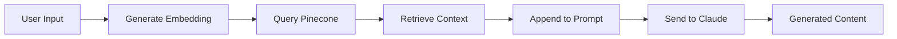

# Pinecone Vector Search Service

Client-side TypeScript service for Pinecone vector database operations. Provides RAG (Retrieval-Augmented Generation) context for AI generation.

**Location**: `src/services/pinecone.ts`

## Overview

The Pinecone service provides:

- **Knowledge Base Queries** - Semantic search for brand guidelines, design patterns, writing rules
- **Document Indexing** - Store and chunk documents for retrieval
- **Context Generation** - Fetch relevant context for AI prompts
- **Database Management** - Clear and rebuild knowledge base

All requests proxy through `/api/pinecone/*` endpoints, which handle embeddings and API keys.

## Knowledge Base Sources

The knowledge base contains:

| Source | Content | Use Case |
|--------|---------|----------|
| `brand-manual` | YBH brand guidelines, voice, colors, typography | PRF, hooks, social posts |
| `anti-ai-writing-guide` | Writing style rules, phrases to avoid | All text generation |
| `brand-narrative` | Brand story, sound bites, messaging | Social posts, hooks |
| `infographic-design-database` | Layout structures (28 types), content templates (10 types), visual style systems | Infographic specs |

## queryKnowledgeBase()

Query the knowledge base for relevant context.

```typescript
function queryKnowledgeBase(
  query: string,
  options?: {
    topK?: number
    filter?: { source?: string }
  }
): Promise<KnowledgeResult[]>
```

### Parameters

<ParamField path="query" type="string" required>
  Search query (semantic, not keyword-based)
</ParamField>

<ParamField path="options.topK" type="number" default="5">
  Number of results to return (max: 20)
</ParamField>

<ParamField path="options.filter.source" type="string">
  Filter by source document (e.g., `"brand-manual"`)
</ParamField>

### Returns

```typescript
interface KnowledgeResult {
  id: string          // Chunk ID
  score: number       // Similarity score (0-1)
  text: string        // Chunk text
  source: string      // Source document
  section: string     // Section heading
}
```

### Example

```typescript
import { queryKnowledgeBase } from '@/services/pinecone'

const results = await queryKnowledgeBase(
  'brand voice and tone for IT leaders',
  { topK: 3 }
)

for (const result of results) {
  console.log(`[${result.source}] ${result.section}`)
  console.log(`Score: ${result.score.toFixed(2)}`)
  console.log(result.text)
  console.log('---')
}
```

Output:

```
[brand-manual] Voice
Score: 0.87
We don't sell. We unsell. Anti-spin, Anti-transactional, Pro-IT leader.
---
[anti-ai-writing-guide] Avoid
Score: 0.82
Don't use phrases like "In today's rapidly changing world" or "Let's dive in".
---
```

## Specialized Query Functions

Pre-configured queries for common use cases.

### queryBrandGuidelines()

Query brand guidelines specifically.

```typescript
function queryBrandGuidelines(query: string): Promise<KnowledgeResult[]>
```

### Example

```typescript
import { queryBrandGuidelines } from '@/services/pinecone'

const guidelines = await queryBrandGuidelines('color palette')
// Returns 3 results from brand-manual
```

### queryInfographicDesign()

Query infographic design database.

```typescript
function queryInfographicDesign(query: string): Promise<KnowledgeResult[]>
```

### Example

```typescript
import { queryInfographicDesign } from '@/services/pinecone'

const designs = await queryInfographicDesign('circular layout structures')
// Returns 5 results from infographic-design-database
```

### queryWritingGuidelines()

Query writing style rules.

```typescript
function queryWritingGuidelines(query: string): Promise<KnowledgeResult[]>
```

### Example

```typescript
import { queryWritingGuidelines } from '@/services/pinecone'

const rules = await queryWritingGuidelines('phrases to avoid')
// Returns 3 results from anti-ai-writing-guide
```

### queryBrandNarrative()

Query brand story and messaging.

```typescript
function queryBrandNarrative(query: string): Promise<KnowledgeResult[]>
```

### Example

```typescript
import { queryBrandNarrative } from '@/services/pinecone'

const narrative = await queryBrandNarrative('sound bites')
// Returns 3 results from brand-narrative
```

## getGenerationContext()

Get combined context from multiple sources for AI generation.

```typescript
function getGenerationContext(
  query: string,
  sources?: ('brand' | 'infographic' | 'writing' | 'narrative')[]
): Promise<string>
```

### Parameters

<ParamField path="sources" type="array" default="['brand', 'writing']">
  Sources to query:
  - `'brand'` - Brand guidelines
  - `'infographic'` - Design database
  - `'writing'` - Writing rules
  - `'narrative'` - Brand story
</ParamField>

### Returns

```typescript
string  // Formatted context block for AI prompts
```

### Example

```typescript
import { getGenerationContext } from '@/services/pinecone'

const context = await getGenerationContext(
  'create LinkedIn post for IT leaders',
  ['brand', 'writing', 'narrative']
)

const prompt = `
Generate a LinkedIn post.

${context}

Topic: ${topicText}
`
```

Output:

```
## Knowledge Base Context

[Brand Manual - Voice]
We don't sell. We unsell. Anti-spin, Anti-transactional, Pro-IT leader.

---

[Anti Ai Writing Guide - Avoid]
Don't use phrases like "In today's rapidly changing world" or "Let's dive in".

---

[Brand Narrative - Headlines]
"Doing to IT what the iPhone did to the Blackberry"
```

## indexDocuments()

Index new documents into the knowledge base.

```typescript
function indexDocuments(
  documents: DocumentChunk[]
): Promise<{
  success: boolean
  indexed: number
  message: string
}>
```

### Parameters

```typescript
interface DocumentChunk {
  id: string          // Unique chunk ID (e.g., "brand-manual-0")
  text: string        // Chunk text (500-1000 chars)
  source: string      // Source document name
  section?: string    // Section heading
}
```

### Example

```typescript
import { indexDocuments, chunkDocument } from '@/services/pinecone'

// 1. Chunk document
const document = `
# Brand Voice

We don't sell. We unsell.
Anti-spin, Anti-transactional, Pro-IT leader.

# Color Palette

Primary: Yellow (#F7B500), Orange (#F17529), Red (#EF4136)
`

const chunks = chunkDocument(document, 'brand-manual', {
  maxChunkSize: 800,
  overlap: 100
})

// 2. Index chunks
const result = await indexDocuments(chunks)
console.log(`Indexed ${result.indexed} chunks`)
```

## chunkDocument()

Chunk large documents for indexing.

```typescript
function chunkDocument(
  text: string,
  source: string,
  options?: {
    maxChunkSize?: number
    overlap?: number
  }
): DocumentChunk[]
```

### Parameters

<ParamField path="options.maxChunkSize" type="number" default="800">
  Maximum characters per chunk
</ParamField>

<ParamField path="options.overlap" type="number" default="100">
  Overlap between chunks (prevents splitting mid-sentence)
</ParamField>

### Example

```typescript
import { chunkDocument } from '@/services/pinecone'

const longDoc = `...10,000 characters...`

const chunks = chunkDocument(longDoc, 'design-guide', {
  maxChunkSize: 800,
  overlap: 100
})

console.log(`Created ${chunks.length} chunks`)

for (const chunk of chunks) {
  console.log(`Chunk ${chunk.id}: ${chunk.text.length} chars`)
  console.log(`Section: ${chunk.section}`)
}
```

### Section Detection

Automatic section header detection:

```typescript
// ALL CAPS lines
BRAND VOICE

// Markdown headers
# Brand Voice
## Color Palette

// Numbered/lettered items
A. CIRCULAR LAYOUTS
1. The Doom Loop
```

## clearKnowledgeBase()

Clear all documents from the knowledge base.

```typescript
function clearKnowledgeBase(): Promise<{
  success: boolean
  message: string
}>
```

### Example

```typescript
import { clearKnowledgeBase } from '@/services/pinecone'

if (confirm('Clear entire knowledge base?')) {
  const result = await clearKnowledgeBase()
  console.log(result.message)
}
```

<Warning>
  **Permanent Deletion**: This removes all indexed documents. You'll need to re-index to restore content.
</Warning>

## Embedding Configuration

Embeddings are generated via OpenRouter:

```typescript
{
  model: 'openai/text-embedding-3-small',
  dimensions: 768
}
```

- **Model**: OpenAI's text-embedding-3-small
- **Dimensions**: 768 (Pinecone index configured for this)
- **Cost**: ~$0.02 per 1M tokens

## Similarity Scores

Similarity scores range from 0 to 1:

| Score | Interpretation |
|-------|----------------|
| `0.9+` | Highly relevant, exact match |
| `0.7-0.9` | Relevant, good match |
| `0.5-0.7` | Somewhat relevant |
| `0.3-0.5` | Weak relevance |
| `<0.3` | Not relevant (usually filtered out) |

### Filtering by Score

```typescript
const results = await queryKnowledgeBase(query, { topK: 10 })

// Keep only high-quality matches
const relevant = results.filter(r => r.score > 0.5)
```

## RAG in AI Generation

How RAG is used in content generation:



### Example Flow

```typescript
// 1. User requests PRF generation
const transcript = '...'

// 2. API generates embedding for RAG query
const query = transcript.slice(0, 500)
const embedding = await getEmbedding(query)

// 3. Query Pinecone for brand context
const results = await queryPinecone(embedding, {
  topK: 5,
  filter: { source: { $in: ['brand-manual', 'anti-ai-writing-guide'] } }
})

// 4. Format context
const ragContext = formatContext(results)

// 5. Append to system prompt
const fullPrompt = systemPrompt + ragContext

// 6. Send to Claude
const prf = await generateWithClaude(fullPrompt, transcript)
```

## Best Practices

### 1. Semantic Queries

Write queries as natural questions or topics:

<CodeGroup>
```typescript Good
await queryKnowledgeBase('How should we write for IT leaders?')
await queryKnowledgeBase('color palette for infographics')
await queryKnowledgeBase('circular layout structures')
```

```typescript Bad
await queryKnowledgeBase('IT leaders')
await queryKnowledgeBase('colors')
await queryKnowledgeBase('layouts')
```
</CodeGroup>

### 2. Filter by Source

Use filters to narrow results:

```typescript
// For infographic generation
const designs = await queryKnowledgeBase('timeline layouts', {
  topK: 5,
  filter: { source: 'infographic-design-database' }
})

// For social posts
const guidelines = await queryKnowledgeBase('LinkedIn post style', {
  topK: 3,
  filter: { source: 'brand-manual' }
})
```

### 3. Adjust topK

More results = more context, but slower:

```typescript
// Quick check (low latency)
const quick = await queryKnowledgeBase(query, { topK: 3 })

// Comprehensive (higher latency)
const detailed = await queryKnowledgeBase(query, { topK: 10 })
```

### 4. Deduplicate Results

When combining multiple sources:

```typescript
const brandResults = await queryBrandGuidelines(query)
const writingResults = await queryWritingGuidelines(query)

const allResults = [...brandResults, ...writingResults]

// Remove duplicates by ID
const seen = new Set<string>()
const unique = allResults.filter(r => {
  if (seen.has(r.id)) return false
  seen.add(r.id)
  return true
})
```

## Error Handling

All functions throw errors that should be caught:

```typescript
try {
  const results = await queryKnowledgeBase(query)
} catch (error) {
  if (error.message.includes('API error: 401')) {
    console.error('Not authenticated')
  } else if (error.message.includes('Query failed')) {
    console.error('Pinecone query failed:', error.message)
  } else {
    console.error('Unknown error:', error.message)
  }
}
```

## Performance

| Operation | Latency | Notes |
|-----------|---------|-------|
| Query (topK=5) | ~300-500ms | Includes embedding + Pinecone query |
| Query (topK=10) | ~400-600ms | Slightly slower |
| Index (100 chunks) | ~2-3s | Includes embedding generation |
| Clear database | ~500ms | Fast operation |

## TypeScript Types

All types are exported:

```typescript
import type { 
  KnowledgeResult, 
  DocumentChunk 
} from '@/services/pinecone'

function MyComponent() {
  const [results, setResults] = useState<KnowledgeResult[]>([])
  // ...
}
```
