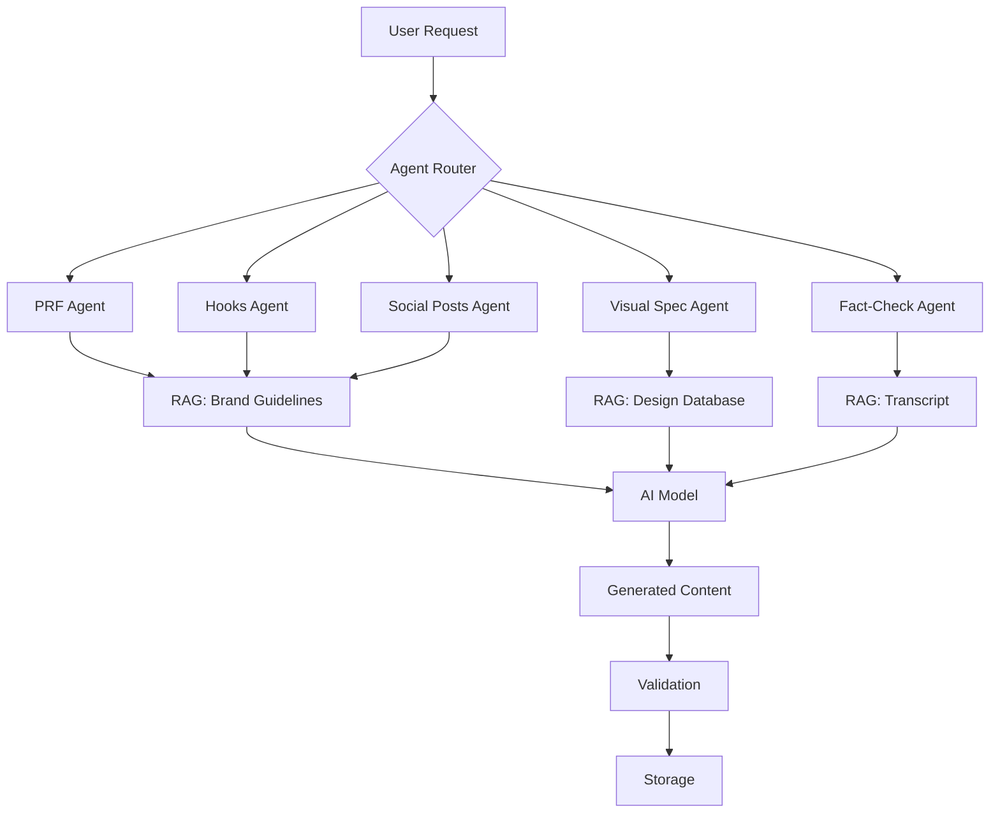

## AI Architecture

YBH Pulse Content uses a **multi-agent AI architecture** where specialized agents handle different content types, each with custom prompts, RAG context, and validation rules.



## Agent System

Each agent specializes in a specific content type with custom configuration.

### Agent Structure

<Tabs>
  <Tab title="Agent Configuration">
    Every agent has:

    ```typescript
    interface Agent {
      id: AgentId                    // 'prf' | 'hooks' | 'linkedin' | ...
      name: string                   // Display name
      systemPrompt: string           // Instructions for AI
      model: string                  // AI model selection
      temperature: number            // Creativity level (0-1)
      ragEnabled: boolean            // Use RAG for context
      factCheckEnabled: boolean      // Validate output
    }
    ```

    Example agent:
    ```json
    {
      "id": "hooks",
      "name": "Viral Hooks Generator",
      "systemPrompt": "You are a viral content strategist...",
      "model": "claude-3.5-sonnet",
      "temperature": 0.8,
      "ragEnabled": true,
      "factCheckEnabled": true
    }
    ```
  </Tab>
  <Tab title="System Prompts">
    System prompts define agent behavior:

    **PRF Agent:**
    ```text
    You are an expert podcast content analyst specializing 
    in B2B technology content for IT leadership audiences.

    Your role: Create structured PRF (Podcast Repurposing 
    Framework) documents that identify key themes, quotes, 
    and actionable insights from podcast transcripts.

    Brand voice: "We don't sell. We unsell." 
    - Anti-spin, pro-IT leader
    - Professional but bold
    - Direct and witty
    - Target: CIOs, CTOs, IT Directors

    Output format: HTML with semantic structure
    - Executive summary
    - Key themes (2-4 themes)
    - Quotable moments
    - Actionable takeaways (3-5 items)
    ```

    **Hooks Agent:**
    ```text
    You are a social media strategist creating viral hooks 
    for IT leadership content.

    Goals:
    - Grab attention in first 3 words
    - Challenge conventional wisdom
    - Include specific, memorable details
    - End with intrigue or question

    Verified facts ONLY: All statistics, quotes, and claims 
    MUST be verifiable in the source transcript. Do NOT 
    fabricate compelling-sounding claims.

    Format: 5-10 hooks, each 1-2 sentences
    ```
  </Tab>
  <Tab title="Model Selection">
    Different models for different needs:

    **Claude 3.5 Sonnet** (default)
    - Best balance of quality and speed
    - Excellent at following instructions
    - Strong fact adherence
    - Use for: PRF, hooks, social posts

    **Claude 3 Opus**
    - Highest quality output
    - Slower and more expensive
    - Best creative reasoning
    - Use for: Complex visual specs, metadata

    **GPT-4 Turbo**
    - Fast, conversational tone
    - Good for social content
    - Less strict fact adherence
    - Use for: Instagram captions (with fact-check)

    **GPT-4o Mini**
    - Fastest, cheapest
    - Good for simple tasks
    - Use for: Spell check, formatting
  </Tab>
</Tabs>

### Agent Workflow

<Steps>
  <Step title="User triggers generation">
    Click "Generate PRF" → Frontend calls `/api/agent/prf`
  </Step>
  <Step title="Backend loads agent config">
    ```typescript
    const agent = settings.agents.find(a => a.id === 'prf')
    const prompt = interpolatePrompt(
      agent.systemPrompt,
      settings.presetFields,
      { episodeNumber, guestName }
    )
    ```
  </Step>
  <Step title="RAG retrieval (if enabled)">
    Fetch relevant context from vector database:
    - Previous PRF examples
    - Brand guidelines
    - YBH content patterns
  </Step>
  <Step title="AI generation with streaming">
    ```typescript
    const stream = await generateText({
      model: agent.model,
      system: prompt,
      messages: [{ role: 'user', content: transcript }],
      temperature: agent.temperature
    })
    
    // Stream progress via SSE
    for await (const chunk of stream) {
      sendSSE({ type: 'progress', content: chunk })
    }
    ```
  </Step>
  <Step title="Validation & fact-check">
    If `factCheckEnabled`, validate output before returning
  </Step>
  <Step title="Response to frontend">
    Return generated content with metadata:
    ```json
    {
      "content": "<h2>Executive Summary</h2>...",
      "model": "claude-3.5-sonnet",
      "tokensUsed": 3420,
      "generationTime": 28.4,
      "factCheckPassed": true
    }
    ```
  </Step>
</Steps>

## RAG (Retrieval Augmented Generation)

RAG enhances AI responses with relevant context from a knowledge base.

### Knowledge Base

Stored in **Pinecone vector database**:

<CardGroup cols={2}>
  <Card title="Brand Guidelines" icon="book">
    - YBH brand voice examples
    - Sound bites and taglines
    - Tone and positioning docs
    - Target audience profiles

    **When used:** All content generation
  </Card>
  <Card title="Design Database" icon="palette">
    - 28 infographic layout types
    - 10 content templates
    - 5 color systems
    - Icon style examples

    **When used:** Visual spec generation
  </Card>
  <Card title="Content Examples" icon="file-lines">
    - Top-performing PRF docs
    - Viral hook patterns
    - Successful social posts
    - High-engagement visuals

    **When used:** All generation for consistency
  </Card>
  <Card title="Generation History" icon="clock-rotate-left">
    - Recent layouts used
    - Guest topics covered
    - Visual style patterns
    - Repetition tracking

    **When used:** Ensure variety
  </Card>
</CardGroup>

### Retrieval Process

```typescript
// 1. Embed the query
const queryEmbedding = await embed(
  `Episode ${episodeNumber} with ${guestName}: ${transcript.slice(0, 500)}`
)

// 2. Search vector database
const results = await pinecone.query({
  vector: queryEmbedding,
  topK: 5,
  filter: { type: 'brand_guideline' }
})

// 3. Inject into prompt
const context = results.matches
  .map(m => m.metadata.content)
  .join('\n\n')

const enhancedPrompt = `
RELEVANT CONTEXT:
${context}

═══════════════════════════════════════
YOUR TASK:
${systemPrompt}
`
```

<Info>
  **Benefits of RAG:**
  - Consistent brand voice across episodes
  - Learns from past successful content
  - Adapts to new patterns without retraining
  - Reduces hallucinations via grounded context
</Info>

## Fact-Checking System

Fact-checking prevents AI hallucinations by validating generated content against the source transcript.

### Why Fact-Checking Matters

AI models can generate **plausible but false** content:

<Warning>
  **Common hallucination examples:**
  - **Statistics:** "73% of CIOs report..." (number invented)
  - **Quotes:** Compelling statement guest never said
  - **Attribution:** Quote from guest, actually said by host
  - **Events:** "In 2019, the company launched..." (date wrong)
</Warning>

Fact-checking catches these before they reach social media.

### Fact-Check Process

<Steps>
  <Step title="Extract checkable items">
    Scan generated content for:
    ```typescript
    interface FactCheckItem {
      type: 'statistic' | 'quote' | 'claim' | 'list'
      content: string
      source: string  // Guest name or "Host"
    }
    ```

    Example extraction:
    ```json
    [
      {
        "type": "statistic",
        "content": "73% of IT leaders regret vendor choice within 6 months",
        "source": "Mark Baker"
      },
      {
        "type": "quote",
        "content": "The challenge is finding the vendor who sucks the least",
        "source": "Mark Baker"
      }
    ]
    ```
  </Step>
  <Step title="Search transcript for evidence">
    Fact-check agent searches transcript:
    ```text
    For each item:
    1. Search for exact match
    2. Search for paraphrase
    3. Verify attribution (who said it)
    4. Check context (is meaning preserved)
    ```
  </Step>
  <Step title="Classify verification status">
    Each item gets a status:

    - **Verified** - Found in transcript, correct attribution
    - **Unverified** - Not found in transcript
    - **Misattributed** - Found but wrong speaker
    - **Fabricated** - Clearly invented, contradicts transcript
  </Step>
  <Step title="Generate validation report">
    ```json
    {
      "overallScore": 85,
      "passedValidation": true,
      "results": [
        {
          "item": { "type": "quote", "content": "..." },
          "status": "verified",
          "confidence": 95,
          "transcriptEvidence": "Found at timestamp 23:45..."
        },
        {
          "item": { "type": "statistic", "content": "73%..." },
          "status": "unverified",
          "confidence": 30,
          "issue": "Statistic not found in transcript",
          "suggestion": "Remove or verify source"
        }
      ],
      "criticalIssues": [
        "Statistic '73% of IT leaders' not found in transcript"
      ]
    }
    ```
  </Step>
</Steps>

### Validation Thresholds

```typescript
// Overall score must be ≥80% to pass
if (factCheck.overallScore < 80) {
  showWarning('Content accuracy issues detected')
}

// Critical issues always warn
if (factCheck.criticalIssues.length > 0) {
  showWarning(factCheck.criticalIssues.join('; '))
}
```

<Tip>
  **Best practice:** Always run fact-check before approving content for publication, especially visual assets that will be widely shared.
</Tip>

## Brand Consistency

All generated content adheres to YBH brand guidelines automatically.

### Brand Voice Rules

Injected into every system prompt:

```text
YBH BRAND VOICE:
- "We don't sell. We unsell."
- Anti-spin, anti-transactional, pro-IT leader
- Professional but bold, witty, direct
- Challenge vendor BS and corporate jargon
- Respect IT leaders' intelligence

TARGET AUDIENCE:
- CIOs, CTOs, IT Directors
- Decision-makers, not influencers
- Tired of vendor spin
- Want honest, practical insights

AVOID:
- Vendor-speak ("leverage", "synergy", "best-in-class")
- Empty buzzwords ("digital transformation", "innovation")
- Patronizing tone
- Hard selling
```

### Visual Brand Consistency

Design specs include brand requirements:

```typescript
// YBH color palette
const BRAND_COLORS = {
  primary: {
    yellow: '#F7B500',
    orange: '#F17529',
    red: '#EF4136'
  },
  secondary: {
    towerGray: '#A4BFC1'
  }
}

// Typography
const BRAND_FONTS = {
  display: 'Fonseca',  // Headlines
  body: 'Montserrat'   // Body text
}

// Every visual spec includes:
"Include YBH branding: gradient (yellow→orange→red) or 
single accent color. Typography: Fonseca for headlines, 
Montserrat for body. Professional but bold aesthetic."
```

### Content Quality Standards

<CardGroup cols={2}>
  <Card title="PRF Documents" icon="file-text">
    - Executive summary: 2-3 sentences
    - Key themes: 2-4 themes max
    - Quotes: Direct, attributed, verified
    - Takeaways: Specific, actionable, numbered
  </Card>
  <Card title="Viral Hooks" icon="bolt">
    - Length: 1-2 sentences
    - Hook: Grab attention in first 3 words
    - Content: Contrarian, specific, memorable
    - Verification: All facts from transcript
  </Card>
  <Card title="Social Posts" icon="share-nodes">
    - LinkedIn: 500-800 chars, professional
    - Instagram: 150-300 chars, visual
    - Hashtags: 1-3 (LinkedIn), 3-5 (Instagram)
    - CTA: Clear, single action
  </Card>
  <Card title="Visual Assets" icon="image">
    - Title: Under 10 words
    - Message: Obvious within 5 seconds
    - Text: Minimal, high contrast
    - Branding: YBH colors or logo present
  </Card>
</CardGroup>

## Prompt Engineering

Effective prompts are crucial for consistent, high-quality output.

### Prompt Structure

```text
[ROLE & EXPERTISE]
You are a [specific role] with expertise in [domain].

[BRAND CONTEXT]
{brand_guidelines}

[TASK DEFINITION]
Your task: [specific output required]

[INPUT CONTEXT]
{episode_metadata}
{transcript}
{prf}

[OUTPUT FORMAT]
- Format: [JSON | HTML | Markdown]
- Structure: [specific schema]
- Constraints: [length, style, etc.]

[VALIDATION RULES]
- All facts MUST be verifiable in transcript
- No fabricated statistics or quotes
- Match brand voice: [specific guidelines]

[EXAMPLES]
{few_shot_examples}
```

### Variable Interpolation

Prompts support dynamic variables:

```typescript
const prompt = `
Generate viral hooks for Episode {{episodeNumber}} 
featuring {{guestName}}.

Recent styles used: {{recentStyles}}
Avoid repetition of these patterns.
`

// Interpolated:
const interpolated = interpolatePrompt(prompt, presetFields, {
  episodeNumber: '348',
  guestName: 'Mark Baker',
  recentStyles: 'Contrarian, Data-Driven, Story Hook'
})
```

<Info>
  **Preset fields** are configurable in Settings:
  - Company name
  - Podcast name
  - Host names
  - Brand taglines
  - Social handles
</Info>

### Few-Shot Examples

Include examples in prompts for pattern matching:

```text
EXAMPLE 1:
Input: [Transcript about vendor selection]
Output: "The challenge isn't finding a vendor. It's finding 
the one who sucks the least."

EXAMPLE 2:
Input: [Transcript about IT respect]
Output: "After interviewing 380 IT professionals, one pattern 
stands out: respect shouldn't only show up when the system 
goes down."

EXAMPLE 3:
Input: [Transcript about uptime]
Output: "Most CIOs focus on uptime. The best ones focus on 
why systems go down in the first place."

Now generate hooks for this episode:
{transcript}
```

## Model Configuration

Fine-tune AI behavior with model parameters.

### Temperature

Controls creativity vs consistency:

```typescript
// Temperature scale: 0.0 - 1.0

const configs = {
  factual: { temperature: 0.2 },     // PRF, fact-check
  balanced: { temperature: 0.7 },    // Social posts, hooks
  creative: { temperature: 0.9 }     // Visual specs, titles
}
```

<Tabs>
  <Tab title="Low (0.0-0.3)">
    **Use for:** Fact-heavy content

    - PRF documents
    - Fact-checking
    - Metadata generation
    - Spell checking

    **Characteristics:**
    - Deterministic output
    - Conservative language
    - High factual accuracy
    - Low variability
  </Tab>
  <Tab title="Medium (0.4-0.7)">
    **Use for:** Balanced content

    - Viral hooks
    - Social posts
    - Video clip suggestions

    **Characteristics:**
    - Some creativity
    - Natural language
    - Balanced accuracy
    - Moderate variability
  </Tab>
  <Tab title="High (0.8-1.0)">
    **Use for:** Creative content

    - Visual specs
    - Title variations
    - Quote card designs

    **Characteristics:**
    - Maximum creativity
    - Unexpected angles
    - Requires more review
    - High variability
  </Tab>
</Tabs>

### Token Limits

Manage context window usage:

```typescript
// Context windows by model
const LIMITS = {
  'claude-3.5-sonnet': 200_000,
  'claude-3-opus': 200_000,
  'gpt-4-turbo': 128_000,
  'gpt-4o-mini': 128_000
}

// Truncate transcript if needed
if (transcript.length > 10_000) {
  const truncated = transcript.slice(0, 10_000)
  const warning = '\n\n[...transcript truncated for context window...]'
  transcript = truncated + warning
}
```

<Warning>
  **Long transcripts** (60+ min episodes) may exceed token limits. The system automatically truncates with a warning, but quality may suffer. Consider splitting very long episodes.
</Warning>

## Performance Optimization

### Streaming Responses

Real-time progress via Server-Sent Events:

```typescript
// Backend streams progress
for await (const chunk of stream) {
  sendSSE({
    type: 'progress',
    step: 'generating',
    detail: 'Analyzing key themes...',
    progress: 45
  })
}

// Frontend updates UI in real-time
eventSource.onmessage = (event) => {
  const { step, detail, progress } = JSON.parse(event.data)
  updateProgressBar(progress)
  updateStatus(detail)
}
```

### Parallel Generation

Multiple AI calls simultaneously:

```typescript
// Instead of sequential:
const prf = await generatePRF(transcript)
const hooks = await generateHooks(prf)
const posts = await generatePosts(prf, hooks)
// Total time: 90 seconds

// Parallel where possible:
const [dataviz, cinematic, quotes] = await Promise.all([
  generateDataViz(prf, hooks),
  generateCinematic(prf, hooks),
  generateQuoteCards(hooks)
])
// Total time: 45 seconds (vs 135 sequential)
```

### Caching (Future)

Planned optimization for repeated content:

```typescript
// Cache transcript embeddings
const embeddingKey = `transcript:${episodeId}`
const cached = await cache.get(embeddingKey)

if (cached) {
  return cached
} else {
  const embedding = await embed(transcript)
  await cache.set(embeddingKey, embedding, { ttl: 86400 })
  return embedding
}
```

## Troubleshooting

### "AI generated incorrect facts"

**Solution:** Run fact-check before approving

```typescript
// Enable fact-check in agent config
agent.factCheckEnabled = true

// Or run manually
const result = await factCheckContent(...)
if (!result.passedValidation) {
  showWarning(result.criticalIssues)
}
```

### "Content doesn't match brand voice"

**Solution:** Review and customize system prompt

1. Go to **Settings > Agents**
2. Select agent (e.g., "Hooks")
3. Edit system prompt with specific voice examples
4. Test with regeneration

### "Generation takes too long"

**Solution:** Switch to faster model or reduce content

```typescript
// Faster model
agent.model = 'gpt-4o-mini'  // vs 'claude-3-opus'

// Reduce transcript length
const truncated = transcript.slice(0, 5000)  // First 5000 chars
```

### "Repeated suggestions across episodes"

**Solution:** Enable variety tracking

```typescript
// Include generation history in prompt
const history = await getRecentLayouts(10)  // Last 10 episodes

const prompt = `
Avoid these recently used layouts:
${history.join(', ')}

Prefer fresh patterns from the design database.
`
```
