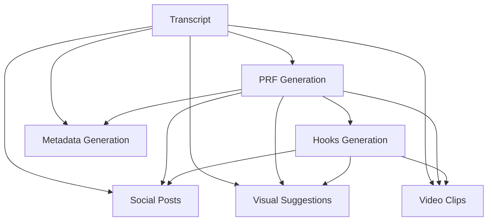

## Content Pipeline Architecture

The content generation pipeline transforms raw transcripts into production-ready assets through a series of AI-powered stages, each building on the outputs of previous stages.



## Stage 1: PRF Generation

**PRF (Podcast Repurposing Framework)** is the foundation of all downstream content. It's a structured analysis of the episode that identifies key themes, insights, and quotable moments.

### Inputs

- **Episode transcript** - Full conversation text
- **Episode metadata** - Number, guest name, title
- **Brand guidelines** - YBH voice and positioning
- **Agent configuration** - Model selection and system prompt

### AI Orchestration

PRF generation uses an **agentic workflow** with:

<Tabs>
  <Tab title="RAG (Retrieval Augmented Generation)">
    Before generating, the AI retrieves relevant context:

    - Previous PRF examples (for style consistency)
    - YBH brand voice guidelines
    - IT leadership content patterns
    - Episode-specific terminology

    This ensures:
    - Consistent formatting across episodes
    - Adherence to brand voice
    - Industry-appropriate language
    - Contextual understanding
  </Tab>
  <Tab title="Status Updates">
    Real-time progress tracking via Server-Sent Events (SSE):

    ```typescript
    onProgress: (step, detail, progress) => {
      // step: 'analyzing' | 'extracting' | 'formatting'
      // detail: Human-readable description
      // progress: 0-100
    }
    ```

    UI displays:
    - Current step ("Analyzing conversation...")
    - Progress bar
    - Estimated time remaining
  </Tab>
  <Tab title="Model Selection">
    Configurable AI model per agent:

    - **Claude 3.5 Sonnet** (default) - Balanced quality/speed
    - **GPT-4 Turbo** - Fast, conversational
    - **Claude 3 Opus** - Maximum quality, slower

    Model selection impacts:
    - Generation speed
    - Content quality
    - API costs
    - Token limits
  </Tab>
</Tabs>

### Output Structure

PRF typically includes:

<CodeGroup>
```markdown Executive Summary
## Executive Summary

[Guest] shares insights on [main topic], drawing from 
[years] of experience in [industry]. Key discussion points 
include [theme 1], [theme 2], and [theme 3].
```

```markdown Key Themes
## Key Themes

### 1. [Theme Title]
[2-3 sentences explaining the theme]

**Key Quote:** "[Direct quote from guest]"

### 2. [Theme Title]
[2-3 sentences explaining the theme]

**Key Quote:** "[Direct quote from guest]"
```

```markdown Actionable Takeaways
## Actionable Takeaways

1. **[Takeaway title]** - [Specific action IT leaders can take]
2. **[Takeaway title]** - [Specific action IT leaders can take]
3. **[Takeaway title]** - [Specific action IT leaders can take]
```
</CodeGroup>

<Note>
  PRF is stored as **HTML** in Sanity, allowing rich formatting. The TipTap editor preserves headings, lists, bold, italics, and other styling.
</Note>

### Approval & Editing

Before approving PRF:

1. **Review for accuracy** - Verify quotes and facts against transcript
2. **Check brand voice** - Ensure "anti-spin" positioning
3. **Edit for clarity** - Simplify jargon, add context
4. **Format for readability** - Use headings, lists, bold

Once approved:
- `prfApproved: true` flag set
- Timestamp recorded (`prfApprovedAt`)
- Hooks and social posts generation enabled

## Stage 2: Hooks Generation

**Viral Hooks** are short, attention-grabbing statements designed for social media engagement. They extract the most quotable, shareable moments from the episode.

### Inputs

- **PRF document** - Themes and quotes
- **Episode transcript** - For fact verification
- **Episode metadata** - Guest name, episode number
- **Previous hooks** - Avoid repetition across episodes

### Generation Strategy

Hooks are generated with specific engagement patterns:

<CardGroup cols={2}>
  <Card title="Contrarian Statement" icon="circle-xmark">
    Challenge conventional wisdom:
    
    "Most CIOs think uptime is success. The best ones know it's just the baseline."
  </Card>
  <Card title="Unexpected Insight" icon="lightbulb">
    Reveal surprising truth:
    
    "After 380 interviews, the pattern is clear: IT leaders who demand respect before crisis get better results."
  </Card>
  <Card title="Direct Quote" icon="quote-left">
    Quotable soundbite:
    
    "The challenge isn't finding a vendor. It's finding the one who sucks the least."
  </Card>
  <Card title="Specific Number" icon="hashtag">
    Data-driven hook:
    
    "73% of IT leaders say vendor relationships are transactional. Here's why that's a problem."
  </Card>
</CardGroup>

### Fact Verification

Every hook is verified against the transcript:

```typescript
// AI receives transcript with verification instructions
const input = `
SOURCE TRANSCRIPT (for fact verification):
${transcript}

═══════════════════════════════════════════════
PRF ANALYSIS:
${prf}

IMPORTANT: Verify all quotes, statistics, and claims 
against the transcript before including in hooks.
`
```

<Warning>
  **Why this matters:** AI can "hallucinate" compelling statements that sound plausible but were never said. Transcript verification prevents this.
</Warning>

### Output Format

Hooks are stored as **HTML** with formatting:

```html
<p><strong>Hook 1:</strong> After interviewing 380 IT professionals, one pattern stands out: respect shouldn't only show up when the system goes down.</p>

<p><strong>Hook 2:</strong> "The challenge? Finding the vendor who sucks the least." - Mark Baker on procurement reality.</p>

<p><strong>Hook 3:</strong> Most teams optimize for uptime. Elite teams optimize for <em>why</em> things go down.</p>
```

## Stage 3: Social Posts Generation

**Platform-specific posts** tailored for LinkedIn and Instagram, each with unique formatting, tone, and CTAs.

### LinkedIn Posts

Generate **two posts** per episode:

<Tabs>
  <Tab title="Release Day Post">
    Published when episode goes live.

    **Structure:**
    ```markdown
    [Hook opening]

    [2-3 paragraphs expanding on theme]

    [Specific insight or quote]

    [Call-to-action: "Listen now"]

    #Leadership #ITStrategy #Podcast
    ```

    **Characteristics:**
    - Announcement tone
    - Episode link in comments
    - 1-3 hashtags
    - ~500-800 characters
  </Tab>
  <Tab title="Follow-Up Post">
    Published 3-5 days after release.

    **Structure:**
    ```markdown
    [Specific insight from episode]

    [Expand with context and implications]

    [Actionable takeaway]

    [CTA: "Catch the full conversation"]

    #CIOInsights #VendorManagement
    ```

    **Characteristics:**
    - Deep-dive on single topic
    - No direct episode announcement
    - More hashtags (2-5)
    - ~600-1000 characters
  </Tab>
</Tabs>

### Verified Facts Bank

LinkedIn posts include a structured facts bank:

```json
{
  "verifiedFactsBank": {
    "directQuotes": [
      "We don't sell. We unsell.",
      "Respect shouldn't only show up when systems fail."
    ],
    "specificNumbers": [
      "380 IT professionals interviewed",
      "73% report transactional vendor relationships"
    ],
    "events": [
      "2019 vendor consolidation initiative",
      "Q4 2023 procurement process redesign"
    ],
    "frameworks": [
      "Three-tier vendor evaluation model",
      "Continuous improvement feedback loop"
    ],
    "insights": [
      "Proactive respect yields better crisis response",
      "Vendor relationships as strategic partnerships"
    ]
  }
}
```

<Info>
  Facts bank is **not visible in the UI** but stored for AI reference. It ensures social posts only use verified content from the transcript.
</Info>

### Instagram Captions

Generate **2-3 captions** with visual-first formatting:

```markdown
Caption 1 (Story Style):
🎙️ NEW EPISODE ALERT

[Guest] breaks down why most IT leaders get 
vendor relationships wrong (and how to fix it)

💡 Key insight: [Quote or statistic]

👆 Swipe for the full story

#YBHPodcast #ITLeadership #VendorManagement

---

Caption 2 (Insight Focus):
"[Compelling quote from episode]"

[2-3 sentences expanding on quote]

🔗 Link in bio to listen

#CIO #TechLeadership #PodcastRecommendation
```

**Characteristics:**
- Emojis for visual breaks
- Shorter paragraphs (mobile reading)
- 3-5 hashtags per caption
- Clear CTA
- 150-300 characters

## Stage 4: Visual Suggestions

**Visual asset generation** creates infographics, quote cards, and data visualizations tailored to episode content.

### Parallel Generation

Instead of sequential generation, visual suggestions are created **in parallel**:

```typescript
// Three AI calls run simultaneously
Promise.all([
  generateDataViz(prf, hooks, transcript),     // 4 suggestions
  generateCinematic(prf, hooks, transcript),   // 4 suggestions
  generateQuoteCards(hooks, transcript)        // 2 suggestions
])
```

**Benefits:**
- Faster overall generation (30-60 seconds vs 2-3 minutes)
- Independent failure handling (one failure doesn't block others)
- Progress tracking per stream

### Suggestion Types

<Tabs>
  <Tab title="Data Visualizations">
    **Specs for charts, frameworks, and statistics**

    Example layouts:
    - Doom Loop (cyclical problem)
    - Quadrant Matrix (2×2 comparison)
    - Pyramid (hierarchy)
    - Pipeline/Funnel (process flow)
    - Card Grid (modular concepts)

    Generated spec:
    ```json
    {
      "layout": "Doom Loop",
      "template": "Problem Cycle",
      "title": "The Vendor Selection Doom Loop",
      "colorSystem": "Problem/Solution (red→green)",
      "iconStyle": "isometric",
      "aspectRatio": "16:9",
      "contentBreakdown": {
        "mainMessage": "Why IT teams keep picking the wrong vendors",
        "sections": [
          "Urgent need drives hasty selection",
          "Hasty selection misses red flags",
          "Red flags surface post-contract",
          "Post-contract issues create urgent need"
        ],
        "dataPoints": [
          "68% of IT leaders regret vendor choice within 6 months",
          "Average contract lock-in: 3 years"
        ]
      },
      "prompt": "[Full Nano Banana Pro prompt]"
    }
    ```
  </Tab>
  <Tab title="Cinematic Infographics">
    **Editorial designs with bold visuals**

    Example templates:
    - Split Screen (Before/After)
    - Hero Quote (large typography)
    - Center-Converge (multiple inputs → outcome)
    - Exploded View (breakdown)

    Focus on:
    - Bold typography
    - High contrast colors
    - Minimal text
    - Emotional impact

    Generated spec:
    ```json
    {
      "layout": "Split Screen",
      "template": "Before/After",
      "title": "Vendor Promises vs. Reality",
      "colorSystem": "High Contrast (cyan/magenta/yellow)",
      "iconStyle": "flat2d",
      "aspectRatio": "1:1",
      "prompt": "[Cinematic prompt with dramatic lighting]"
    }
    ```
  </Tab>
  <Tab title="Quote Cards">
    **Guest quotes with YBH branding**

    Simpler specs:
    - Quote text (max 2 sentences)
    - Attribution (guest name + title)
    - Background style (dark cinematic)
    - Typography emphasis

    Generated spec:
    ```json
    {
      "layout": "hero_quote",
      "template": "Quote Card",
      "title": "Quote from Mark Baker",
      "colorSystem": "dark_cinematic",
      "iconStyle": "flat2d",
      "aspectRatio": "1:1",
      "pullQuote": {
        "text": "The challenge isn't finding a vendor. It's finding the one who sucks the least.",
        "attribution": "Mark Baker, CIO"
      },
      "prompt": "[Quote card prompt]"
    }
    ```
  </Tab>
</Tabs>

### Variety Tracking

AI avoids repetition by checking **generation history**:

```typescript
const history = episode.generatedAssets
  .map(a => a.spec.layout)
  .filter(Boolean)

// Recent layouts across all episodes
const recentLayouts = [
  "Doom Loop", "Doom Loop", "Quadrant Matrix", 
  "Pyramid", "Split Screen"
]

// AI prompt includes:
"Avoid recently used layouts: Doom Loop (used 2x recently), 
Quadrant Matrix, Pyramid. Prefer: Pipeline, Card Grid, 
Hub & Spoke."
```

## Stage 5: Image Generation

Once specs are created, images are rendered using **Kie.ai Nano Banana Pro**.

### Generation Flow

<Steps>
  <Step title="Submit task to Kie.ai">
    ```typescript
    const { taskId } = await createTask({
      prompt: spec.prompt,
      aspectRatio: '16:9',
      resolution: '2K',
      outputFormat: 'png'
    })
    ```
  </Step>
  <Step title="Poll for completion">
    ```typescript
    const result = await waitForTask(taskId, {
      maxAttempts: 90,  // 4.5 minutes max
      intervalMs: 3000,  // Check every 3 seconds
      onProgress: (attempt, max, state) => {
        // Update UI progress bar
      }
    })
    ```
  </Step>
  <Step title="Store image URL">
    ```typescript
    await updateSuggestion({
      imageUrl: result.imageUrl,
      imageGeneratedAt: new Date().toISOString(),
      status: 'imageReady'
    })
    ```
  </Step>
</Steps>

### Resolution & Aspect Ratio

<CardGroup cols={3}>
  <Card title="16:9 Landscape" icon="rectangle-wide">
    **Best for:**
    - LinkedIn posts
    - Blog headers
    - YouTube thumbnails

    **Resolution:**
    - 1K: 1920×1080
    - 2K: 2560×1440
    - 4K: 3840×2160
  </Card>
  <Card title="1:1 Square" icon="square">
    **Best for:**
    - Instagram posts
    - Quote cards
    - Profile images

    **Resolution:**
    - 1K: 1080×1080
    - 2K: 2048×2048
    - 4K: 4096×4096
  </Card>
  <Card title="9:16 Portrait" icon="rectangle-vertical">
    **Best for:**
    - Instagram Stories
    - TikTok
    - Reels

    **Resolution:**
    - 1K: 1080×1920
    - 2K: 1440×2560
    - 4K: 2160×3840
  </Card>
</CardGroup>

## Stage 6: Video Clips

**Short-form video suggestions** identify the most engaging moments for TikTok, Reels, and YouTube Shorts.

### Clip Structure

Each suggestion includes:

```typescript
interface VideoSuggestion {
  thumbnailHook: string          // Text overlay (3-5 words)
  hookSentence: string           // First 3 seconds of video
  transcript: string             // Full clip transcript
  approximateTimestamps: {       // Estimated location in episode
    start: string                // "12:34"
    end: string                  // "13:45"
  }
  duration: string               // "60-90 seconds"
  whyItWorks: string             // Editorial rationale
  sourceSection: string          // Context from PRF
}
```

### Example Output

<CodeGroup>
```json Clip 1: Controversy Hook
{
  "thumbnailHook": "Vendor selection is broken",
  "hookSentence": "Most IT leaders get vendor selection completely wrong.",
  "transcript": "Most IT leaders get vendor selection completely wrong. They focus on features and pricing, but that's not what matters. What matters is: can this vendor make you successful? Not can they deliver the product, but will they invest in your success? That's the difference between a transaction and a partnership.",
  "approximateTimestamps": { "start": "23:15", "end": "24:30" },
  "duration": "75 seconds",
  "whyItWorks": "Contrarian opening grabs attention, then provides actionable reframe",
  "sourceSection": "Vendor Relationships (PRF Section 3)"
}
```

```json Clip 2: Story Hook
{
  "thumbnailHook": "The $2M mistake",
  "hookSentence": "We signed a 3-year contract and regretted it within 6 months.",
  "transcript": "We signed a 3-year contract and regretted it within 6 months. The vendor promised 24/7 support, but in reality, it was 'we'll get back to you in 3-5 business days.' They promised seamless integration, but we spent 8 months just getting basic functionality working. The lesson? Test the relationship before you sign. Do a pilot. Do a trial. See how they respond when things go wrong.",
  "approximateTimestamps": { "start": "34:20", "end": "35:30" },
  "duration": "70 seconds",
  "whyItWorks": "Personal story creates relatability, ends with actionable advice",
  "sourceSection": "Procurement Lessons (PRF Section 4)"
}
```
</CodeGroup>

<Tip>
  Video clips are **suggestions only**. Video editors use these as starting points, adjusting timestamps and length based on actual footage.
</Tip>

## Fact-Checking System

All generated content is validated against the transcript to prevent hallucinations.

### Fact-Check Agent

Runs automatically during visual suggestions generation:

```typescript
const factCheck = await factCheckContent(
  transcript,
  prf,
  guestName,
  items,  // Extracted from all suggestions
  'Doug'  // Co-host name for attribution
)
```

### Validation Process

<Steps>
  <Step title="Extract fact-checkable items">
    From all suggestions:
    - Statistics and numbers
    - Direct quotes
    - Claims and assertions
    - Lists and frameworks
  </Step>
  <Step title="Search transcript for evidence">
    AI searches for supporting evidence:
    - Exact quote matches
    - Paraphrased statements
    - Statistical sources
    - Attribution verification
  </Step>
  <Step title="Classify each item">
    ```typescript
    type Status = 
      | 'verified'      // Found in transcript
      | 'unverified'   // Not found
      | 'misattributed' // Wrong speaker
      | 'fabricated'   // Clearly invented
    ```
  </Step>
  <Step title="Generate report">
    ```json
    {
      "overallScore": 85,
      "passedValidation": true,
      "criticalIssues": [
        "Statistic '73% of vendors' not found in transcript"
      ],
      "results": [...]
    }
    ```
  </Step>
</Steps>

<Warning>
  **Fact-check threshold:** Overall score must be ≥80% to pass validation. Critical issues trigger warnings in the UI.
</Warning>

## Pipeline Performance

### Generation Times

| Stage | Average Time | Range |
|-------|-------------|-------|
| PRF | 30-45s | 20-60s |
| Hooks | 20-30s | 15-40s |
| LinkedIn Posts | 25-35s | 20-50s |
| Instagram Captions | 15-25s | 10-30s |
| Visual Suggestions (10) | 45-60s | 30-90s |
| Image Rendering (per image) | 60-120s | 30-180s |
| Video Clips | 20-30s | 15-40s |
| Fact-Check | 15-25s | 10-40s |

<Note>
  Times vary based on transcript length, model selection, and API response times. Claude models are generally faster than GPT-4.
</Note>

### Cost Optimization

- **Model selection:** Claude 3.5 Sonnet offers best balance of quality and cost
- **Parallel generation:** Reduces wall-clock time without increasing token usage
- **Prompt caching:** Reuses transcript analysis across multiple stages (future feature)
- **Selective regeneration:** Only regenerate specific content, not entire pipeline
