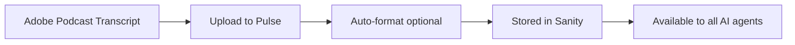
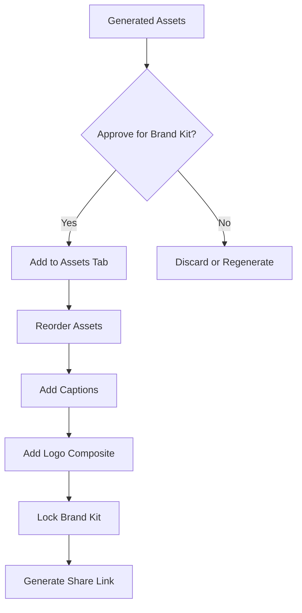

## Content Production Workflow

YBH Pulse Content follows a structured workflow that transforms raw podcast transcripts into polished, multi-platform content assets.

<Frame>
  
</Frame>

## Workflow Stages

### 1. Episode Creation

<Steps>
  <Step title="Create episode">
    Start by creating a new episode from the Episodes page. You can link a guest from the Guest Directory or create a standalone episode.
  </Step>
  <Step title="Set episode metadata">
    Configure episode number, guest name, title, and LinkedIn URL. This metadata drives content generation prompts and file naming.
  </Step>
  <Step title="Link guest (optional)">
    Linking a guest enables:
    - Automatic status updates (Recorded → In Production → Complete)
    - Career timeline generation from LinkedIn
    - Share link delivery tracking
    - Cross-referencing in Guest Directory
  </Step>
</Steps>

### 2. Transcript Upload & Processing

The transcript is the **single source of truth** for all generated content:



<Note>
  **Why transcripts matter:** All AI generation includes the transcript as context for fact-checking. This prevents hallucinations and ensures generated content is grounded in what was actually said.
</Note>

#### Supported formats

- Plain text (`.txt`)
- Microsoft Word (`.docx`)
- PDF documents (`.pdf`)
- Direct paste into editor

#### Auto-formatting

Enable auto-format to clean up transcripts:
- Removes speaker labels ("Doug:", "Guest:", etc.)
- Fixes inconsistent line breaks
- Preserves paragraph structure
- Removes timestamps if present

### 3. Content Generation Pipeline

Content is generated in a specific order, with each stage building on previous outputs:

<Tabs>
  <Tab title="Stage 1: PRF">
    **Podcast Repurposing Framework**

    Auto-generated after transcript upload.

    **Inputs:**
    - Episode transcript
    - Episode number and guest name
    - YBH brand guidelines

    **Outputs:**
    - Executive summary
    - Key themes and topics
    - Quotable soundbites
    - Business frameworks discussed
    - Practical takeaways

    **What it enables:**
    - Foundation for all downstream content
    - Hooks generation
    - Social posts
    - Visual asset suggestions

    <Info>
      PRF must be approved before generating hooks and social posts. This ensures quality control at the foundation of the content pipeline.
    </Info>
  </Tab>
  <Tab title="Stage 2: Hooks">
    **Viral Hooks**

    Auto-generated after PRF is created.

    **Inputs:**
    - PRF document
    - Episode transcript (for fact verification)
    - Episode metadata

    **Outputs:**
    - 5-10 attention-grabbing statements
    - Formatted for social media
    - Optimized for engagement

    **What it enables:**
    - LinkedIn and Instagram posts
    - Quote card content
    - Video clip titles

    Example hooks:
    ```text
    "After interviewing 380 IT professionals, one pattern 
    stands out: respect shouldn't only show up when the 
    system goes down."

    "The challenge? Finding the vendor who sucks the least."

    "Most CIOs focus on uptime. The best ones focus on why 
    systems go down in the first place."
    ```
  </Tab>
  <Tab title="Stage 3: Metadata">
    **Episode Metadata (Optional)**

    Generated on-demand for Sanity podcast page.

    **Inputs:**
    - Transcript
    - PRF (if available)
    - Guest name and episode number

    **Outputs:**
    - Episode title (SEO-optimized)
    - Short description (1-2 sentences)
    - Long description ("On this episode..." content)
    - 3 key takeaways
    - Timestamped show notes

    **What it enables:**
    - Push to YBH podcast CMS
    - SEO and discoverability
    - Episode page content
  </Tab>
  <Tab title="Stage 4: Social Posts">
    **Platform-Specific Posts**

    Generated on-demand after PRF and hooks are approved.

    **LinkedIn Posts:**
    - Release day announcement
    - Follow-up post (3-5 days later)
    - Verified facts bank (quotes, numbers, frameworks)
    - Character count tracking

    **Instagram Captions:**
    - Story-style formatting
    - Emoji integration
    - Hashtag recommendations
    - Call-to-action prompts

    **Inputs:**
    - Transcript (for fact verification)
    - PRF analysis
    - Viral hooks
    - Episode metadata

    **What it enables:**
    - Social media scheduling
    - Multi-platform distribution
    - Consistent brand voice
  </Tab>
  <Tab title="Stage 5: Visual Assets">
    **Infographics, Quote Cards, Timelines**

    Generated on-demand via Design Studio.

    **Suggestion Generation:**
    - 4 data visualizations
    - 4 cinematic infographics
    - 2 quote cards
    - Parallel generation (all at once)

    **Inputs:**
    - PRF and hooks
    - Episode transcript
    - Generation history (for variety)

    **Outputs:**
    - Complete design specs (layout, template, colors)
    - Image generation prompts
    - Content breakdowns

    **Image Rendering:**
    - Powered by Kie.ai Nano Banana Pro
    - 16:9, 1:1, or 9:16 aspect ratios
    - 1K, 2K, or 4K resolution
    - PNG or JPG output

    **What it enables:**
    - Social media visuals
    - Guest brand kit assets
    - LinkedIn carousel posts
  </Tab>
  <Tab title="Stage 6: Video Clips">
    **Short-Form Video Suggestions**

    Generated on-demand for TikTok, Reels, Shorts.

    **Inputs:**
    - Transcript
    - PRF and hooks
    - Episode metadata

    **Outputs:**
    - 3 clip suggestions
    - Thumbnail hooks (text overlay)
    - Hook sentences (first 3 seconds)
    - Full transcript for clip
    - Approximate timestamps
    - Duration estimates
    - Editorial rationale ("Why it works")

    **What it enables:**
    - Video editing guidance
    - Clip prioritization
    - Multi-format content strategy
  </Tab>
</Tabs>

### 4. Content Review & Editing

All generated content is editable before approval:

<CardGroup cols={2}>
  <Card title="Rich Text Editing" icon="pen-to-square">
    - TipTap editor with full formatting
    - Tables, images, highlights
    - Slash commands for quick actions
    - Inline spell check and fact check
  </Card>
  <Card title="Approval Workflow" icon="check-circle">
    - PRF approval (gates downstream content)
    - Hooks approval
    - LinkedIn approval
    - Asset approval for brand kit
  </Card>
  <Card title="AI Assistance" icon="sparkles">
    - Spell check (grammar and typos)
    - Fact check (validate against transcript)
    - Regenerate specific sections
    - Alternative title suggestions
  </Card>
  <Card title="Version Control" icon="clock-rotate-left">
    - Original content preserved
    - Reset to original button
    - Edit history (future feature)
    - Approval timestamps
  </Card>
</CardGroup>

### 5. Brand Kit Curation

Select and organize assets for guest delivery:



<Steps>
  <Step title="Review generated assets">
    - View all suggestions on Assets tab
    - Generate images for approved specs
    - Add YBH logo composite if needed
  </Step>
  <Step title="Select assets for brand kit">
    - Toggle visibility for each asset
    - Drag to reorder (guest sees in this order)
    - Add captions for context
  </Step>
  <Step title="Preview guest view">
    - Click "Preview Brand Kit"
    - See exactly what guest will see
    - Check for placeholder text or errors
  </Step>
  <Step title="Lock and share">
    - Lock brand kit to finalize curation
    - Generate share link (permanent URL)
    - Copy link and send to guest
  </Step>
</Steps>

<Warning>
  **Important:** Once brand kit is locked and shared, guests can access it immediately. Unlocking and editing will update the live page. Always preview before sharing.
</Warning>

### 6. Guest Delivery & Analytics

Guests receive a premium brand kit experience:

**Brand Kit Page Features:**
- Cinematic hero with guest name and episode number
- PRF summary with editorial typography
- Viral hooks with oversized quote marks
- Career timeline (if available)
- Visual assets in masonry grid with lightbox
- Download buttons (images ZIP / full kit ZIP)
- YBH service rail CTA (optional)

**Tracking:**
- View count (how many times page loaded)
- Individual asset views (lightbox opens)
- Download counts (images / full kit)
- Referrer URLs (where traffic came from)
- User agents (desktop vs mobile)

## Status Progression

Episodes move through statuses as content is created:

<Steps>
  <Step title="Draft">
    **Initial state** after episode creation.

    - No transcript uploaded
    - Metadata may be incomplete
    - No content generated

    **Next action:** Upload transcript
  </Step>
  <Step title="In Progress">
    **Active production** with content generation underway.

    Automatically set when:
    - PRF is generated
    - Hooks are generated
    - Social posts are created
    - Visual assets are generated

    **Next action:** Complete content pipeline
  </Step>
  <Step title="Complete">
    **Ready for delivery** with brand kit shared.

    Automatically set when:
    - Share link is generated
    - Brand kit is locked
    - All required content approved

    **Next action:** Send share link to guest
  </Step>
</Steps>

<Info>
  If a guest is linked, their status also updates:
  - **Recorded** - When transcript uploaded
  - **In Production** - When PRF generated
  - **Complete** - When share link created
</Info>

## Workflow Best Practices

### Before you start

1. **Clean your transcript**
   - Remove ads, intros, outros
   - Fix speaker attribution
   - Ensure guest name is spelled correctly
   - Use auto-format for consistency

2. **Set complete metadata**
   - Episode number (required for file naming)
   - Guest name (used in all prompts)
   - Guest LinkedIn URL (enables timeline)
   - Episode title (or generate with AI)

### During content generation

1. **Review before approving**
   - Read entire PRF before approval
   - Run fact-check on generated content
   - Use spell check on social posts
   - Test share links before sending

2. **Maintain brand voice**
   - Edit AI content to match YBH style
   - Remove corporate jargon
   - Add personality and wit where appropriate
   - Ensure "anti-spin" positioning

3. **Optimize for platforms**
   - LinkedIn: professional, insight-driven
   - Instagram: visual, story-driven
   - Quote cards: bold, quotable
   - Infographics: data-driven, actionable

### After brand kit delivery

1. **Track engagement**
   - Monitor view counts
   - Check download stats
   - Review referrer sources
   - Follow up with guests who viewed

2. **Repurpose content**
   - Schedule social posts
   - Use assets in email campaigns
   - Share on YBH website
   - Create LinkedIn carousels

3. **Iterate and improve**
   - Review what assets guests download most
   - Test different visual styles
   - Experiment with hook formats
   - Refine prompts based on results

## Common Patterns

### Fast-track workflow (minimal editing)

```text
1. Create episode with guest
2. Upload transcript (auto-format enabled)
3. Generate PRF → Approve immediately
4. Generate hooks → Approve immediately
5. Generate visual suggestions → Select top 3
6. Add logos → Lock brand kit → Share

Time: ~30 minutes
```

### Premium workflow (full curation)

```text
1. Create episode with guest
2. Upload and manually clean transcript
3. Generate PRF → Edit for clarity → Approve
4. Generate hooks → Rewrite 2-3 → Approve
5. Generate LinkedIn posts → Spell check → Approve
6. Generate Instagram posts → Edit emojis → Save
7. Generate 2 rounds of visual suggestions (20 total)
8. Select best 6-8 assets
9. Generate images → Add logos → Edit captions
10. Generate career timeline
11. Preview brand kit → Lock → Share

Time: ~2-3 hours
```

### Regeneration workflow (fix issues)

```text
1. Identify problem (e.g., factual error in hook)
2. Run fact-check to find specific issue
3. Edit transcript to clarify if needed
4. Regenerate specific content (hooks only)
5. Review new output against transcript
6. Approve and continue pipeline

Time: ~15 minutes per regeneration
```
